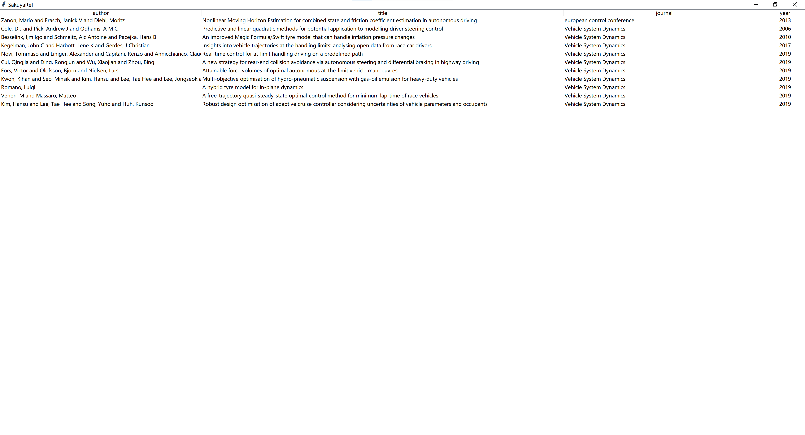

# Sakuya Reference

[English Version](#Sakuya-Ref-Eng-Ver)

这是一个非常无聊的个人用的文献查看器，只是方便查看 bib 文件用的。

为什么 Zotero 免费只给 300M

为什么 Jabref 体积这么大

# 支持的系统

我只在我的 windows 10 上跑了一下试试，但是总共也没几行，改一改应该可以在其他平台上跑。

我是 4K 的屏，所以有个缩放的选项，不需要的可以删掉

# 如何运行

依赖项
- bibtexparser
- tkinter
- pyperclip

clone 以后，把唯一的一个 py 文件里面的 paperdir 改成你自己的用来放论文的文件夹，然后把你的 bib 文件放进这个文件夹，运行这个 py 文件。

我习惯创建一个 bat 文件，在里面输入 'start pythonw path-to-this-folder\SakuyaRef.py'.

# 绑定文件

在单个条目上右键有一个 bind pdf 的选项，选择 PDF 文件后，会自动把 PDF 文件复制到 paperdir 中，同时文件名改成 bib 文件中的 ID。

# 查看文件

在条目上回车，或者是在条目右键上选择 view pdf 就可以了。

# 清除绑定

这个会把之前绑定文件时候复制的文件删掉。

# 复制文章标题

选中单个条目后右键会出现 copy title，选择后就可以复制标题了。

# 待实现

删除条目
编辑条目信息（大概率不会写，我习惯直接编辑 bib 文件）

# Sakuya Ref Eng Ver

A bibtex file viewer.

Zotero is free for only 300MB.

Jabref installation file is so large.

# Supported OS

Only tested on my windows 10.

I use a 4K screen, so I added a windll.shcore.SetProcessDpiAwareness(1) in the code.

# How to run

Dependences
- bibtexparser
- tkinter
- pyperclip

Clone it. Change paperdir. Copy your bib file into this dir. Run the python script.

I tend to create a bat file and type 'start pythonw path-to-this-folder\SakuyaRef.py'.

# Bind file

Right click on a single item. Select 'bind pdf'. Selected file will be copyed into paperdir. Named 'ID.pdf' where ID is the ID in bib file.

# View pdf

Right click the item and select 'view pdf'. Or double click the item. Or select the item and hit 'enter'.

# Clear bind

Delete the binded file in paperdir.

# Copy title

Right click item, then select 'copy title' to copy title.